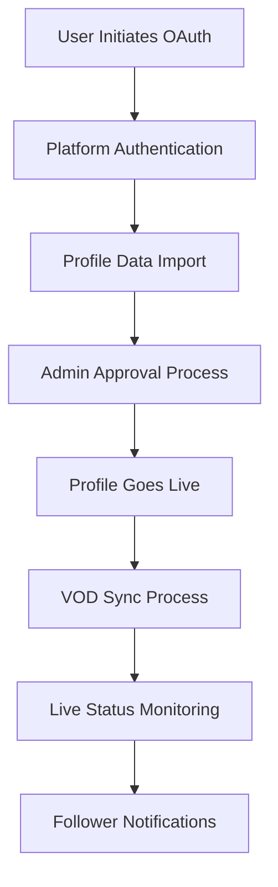

# Design Document: Streamer Profiles System

## Overview

The Streamer Profiles system extends the existing Laravel application to support verified streamer accounts with OAuth integration, profile management, VOD display, dual-identity reviews, and community features. The system leverages existing infrastructure including Laravel Socialite for OAuth, Spatie Permissions for role management, and the current review system architecture.

## Architecture

### High-Level Architecture

The system follows Laravel's MVC pattern with additional service layers for external API integration:

```
┌─────────────────┐    ┌─────────────────┐    ┌─────────────────┐
│   Frontend      │    │   Controllers   │    │   Services      │
│   (Blade/Livewire)   │   (API/Web)     │    │   (OAuth/API)   │
└─────────────────┘    └─────────────────┘    └─────────────────┘
         │                       │                       │
         └───────────────────────┼───────────────────────┘
                                 │
┌─────────────────┐    ┌─────────────────┐    ┌─────────────────┐
│   Models        │    │   Database      │    │   External APIs │
│   (Eloquent)    │    │   (MySQL)       │    │   (Twitch/YT/Kick)
└─────────────────┘    └─────────────────┘    └─────────────────┘
```

### Integration Points

- **Laravel Socialite**: OAuth integration with streaming platforms
- **Existing User System**: Extends current user model and authentication
- **Review System**: Integrates with existing review architecture for dual-identity posting
- **Notification System**: Leverages existing notification infrastructure
- **Filament Admin**: Extends admin panel for streamer management

## Components and Interfaces

### 1. Database Schema Extensions

#### Streamer Profiles Table
```sql
CREATE TABLE streamer_profiles (
    id BIGINT PRIMARY KEY AUTO_INCREMENT,
    user_id BIGINT NOT NULL,
    platform ENUM('twitch', 'youtube', 'kick') NOT NULL,
    platform_user_id VARCHAR(255) NOT NULL,
    channel_name VARCHAR(255) NOT NULL,
    channel_url VARCHAR(500) NOT NULL,
    profile_photo_url VARCHAR(500),
    bio TEXT,
    is_verified BOOLEAN DEFAULT FALSE,
    is_approved BOOLEAN DEFAULT FALSE,
    oauth_token TEXT,
    oauth_refresh_token TEXT,
    oauth_expires_at TIMESTAMP NULL,
    created_at TIMESTAMP DEFAULT CURRENT_TIMESTAMP,
    updated_at TIMESTAMP DEFAULT CURRENT_TIMESTAMP ON UPDATE CURRENT_TIMESTAMP,
    FOREIGN KEY (user_id) REFERENCES users(id) ON DELETE CASCADE,
    UNIQUE KEY unique_platform_user (platform, platform_user_id)
);
```

#### Streamer Schedules Table
```sql
CREATE TABLE streamer_schedules (
    id BIGINT PRIMARY KEY AUTO_INCREMENT,
    streamer_profile_id BIGINT NOT NULL,
    day_of_week TINYINT NOT NULL, -- 0=Sunday, 6=Saturday
    start_time TIME NOT NULL,
    end_time TIME NOT NULL,
    timezone VARCHAR(50) NOT NULL,
    notes VARCHAR(255),
    is_active BOOLEAN DEFAULT TRUE,
    created_at TIMESTAMP DEFAULT CURRENT_TIMESTAMP,
    updated_at TIMESTAMP DEFAULT CURRENT_TIMESTAMP ON UPDATE CURRENT_TIMESTAMP,
    FOREIGN KEY (streamer_profile_id) REFERENCES streamer_profiles(id) ON DELETE CASCADE
);
```

#### Streamer VODs Table
```sql
CREATE TABLE streamer_vods (
    id BIGINT PRIMARY KEY AUTO_INCREMENT,
    streamer_profile_id BIGINT NOT NULL,
    platform_vod_id VARCHAR(255) NOT NULL,
    title VARCHAR(500) NOT NULL,
    description TEXT,
    thumbnail_url VARCHAR(500),
    vod_url VARCHAR(500) NOT NULL,
    duration_seconds INT,
    published_at TIMESTAMP,
    is_manual BOOLEAN DEFAULT FALSE,
    created_at TIMESTAMP DEFAULT CURRENT_TIMESTAMP,
    updated_at TIMESTAMP DEFAULT CURRENT_TIMESTAMP ON UPDATE CURRENT_TIMESTAMP,
    FOREIGN KEY (streamer_profile_id) REFERENCES streamer_profiles(id) ON DELETE CASCADE,
    UNIQUE KEY unique_platform_vod (streamer_profile_id, platform_vod_id)
);
```

#### Streamer Social Links Table
```sql
CREATE TABLE streamer_social_links (
    id BIGINT PRIMARY KEY AUTO_INCREMENT,
    streamer_profile_id BIGINT NOT NULL,
    platform VARCHAR(50) NOT NULL, -- twitter, instagram, discord, etc.
    url VARCHAR(500) NOT NULL,
    display_name VARCHAR(100),
    created_at TIMESTAMP DEFAULT CURRENT_TIMESTAMP,
    updated_at TIMESTAMP DEFAULT CURRENT_TIMESTAMP ON UPDATE CURRENT_TIMESTAMP,
    FOREIGN KEY (streamer_profile_id) REFERENCES streamer_profiles(id) ON DELETE CASCADE
);
```

#### Streamer Followers Table
```sql
CREATE TABLE streamer_followers (
    id BIGINT PRIMARY KEY AUTO_INCREMENT,
    user_id BIGINT NOT NULL,
    streamer_profile_id BIGINT NOT NULL,
    notification_preferences JSON, -- {live: true, reviews: true}
    created_at TIMESTAMP DEFAULT CURRENT_TIMESTAMP,
    updated_at TIMESTAMP DEFAULT CURRENT_TIMESTAMP ON UPDATE CURRENT_TIMESTAMP,
    FOREIGN KEY (user_id) REFERENCES users(id) ON DELETE CASCADE,
    FOREIGN KEY (streamer_profile_id) REFERENCES streamer_profiles(id) ON DELETE CASCADE,
    UNIQUE KEY unique_follower (user_id, streamer_profile_id)
);
```

#### Reviews Table Extension
```sql
ALTER TABLE reviews ADD COLUMN streamer_profile_id BIGINT NULL;
ALTER TABLE reviews ADD FOREIGN KEY (streamer_profile_id) REFERENCES streamer_profiles(id) ON DELETE SET NULL;
```

### 2. Model Architecture

#### StreamerProfile Model
```php
class StreamerProfile extends Model
{
    // Relationships
    public function user(): BelongsTo
    public function schedules(): HasMany
    public function vods(): HasMany  
    public function socialLinks(): HasMany
    public function followers(): HasMany
    public function reviews(): HasMany
    
    // Scopes
    public function scopeApproved($query)
    public function scopeVerified($query)
    public function scopePlatform($query, $platform)
    
    // Methods
    public function isLive(): bool
    public function getDisplayName(): string
    public function canPostReviews(): bool
    public function refreshPlatformData(): void
}
```

#### Extended User Model
```php
// Add to existing User model
public function streamerProfile(): HasOne
public function followedStreamers(): BelongsToMany
public function isStreamer(): bool
public function canCreateStreamerProfile(): bool
```

#### Extended Review Model
```php
// Add to existing Review model
public function streamerProfile(): BelongsTo
public function isStreamerReview(): bool
public function getAuthorDisplayNameAttribute(): string // Enhanced for streamers
```

### 3. Service Layer

#### OAuth Integration Service
```php
class StreamerOAuthService
{
    public function initiateConnection(string $platform, User $user): string
    public function handleCallback(string $platform, string $code, User $user): StreamerProfile
    public function refreshToken(StreamerProfile $profile): bool
    public function revokeConnection(StreamerProfile $profile): bool
}
```

#### Platform API Service
```php
class PlatformApiService
{
    public function fetchChannelData(StreamerProfile $profile): array
    public function fetchVods(StreamerProfile $profile, int $limit = 10): array
    public function checkLiveStatus(StreamerProfile $profile): bool
    public function validateChannelOwnership(StreamerProfile $profile): bool
}
```

#### Notification Service Extension
```php
class StreamerNotificationService
{
    public function notifyFollowersOfLiveStream(StreamerProfile $profile): void
    public function notifyFollowersOfNewReview(Review $review): void
    public function sendFollowNotification(StreamerProfile $profile, User $follower): void
}
```

### 4. Controller Architecture

#### StreamerProfileController
- `index()` - List all approved streamer profiles
- `show(StreamerProfile $profile)` - Display public profile
- `create()` - Show OAuth connection options
- `store()` - Handle profile creation after OAuth
- `edit()` - Profile management for streamers
- `update()` - Update profile information

#### StreamerOAuthController
- `redirect($platform)` - Redirect to OAuth provider
- `callback($platform)` - Handle OAuth callback
- `disconnect()` - Remove OAuth connection

#### StreamerFollowController
- `follow(StreamerProfile $profile)` - Follow a streamer
- `unfollow(StreamerProfile $profile)` - Unfollow a streamer
- `followers()` - List user's followed streamers

## Data Models

### Core Entities

1. **StreamerProfile**
   - Primary entity linking users to streaming platforms
   - Stores OAuth tokens and platform-specific data
   - Manages verification and approval status

2. **StreamerSchedule**
   - Represents streaming schedule entries
   - Supports multiple timezones
   - Allows for recurring weekly schedules

3. **StreamerVod**
   - Stores VOD metadata from platforms
   - Supports both imported and manually added content
   - Links to original platform content

4. **StreamerFollower**
   - Many-to-many relationship between users and streamers
   - Includes notification preferences
   - Tracks follow/unfollow history

### Data Flow



## Error Handling

### OAuth Error Scenarios
- **Invalid/Expired Tokens**: Automatic refresh attempt, fallback to re-authentication
- **Platform API Downtime**: Graceful degradation, cached data display
- **Rate Limiting**: Exponential backoff, queue-based retry system
- **Account Suspension**: Profile deactivation, user notification

### Data Integrity
- **Duplicate Profiles**: Platform-specific unique constraints
- **Orphaned Data**: Cascade deletes and cleanup jobs
- **Invalid Schedule Data**: Timezone validation and normalization
- **Broken VOD Links**: Regular health checks and cleanup

### User Experience
- **Connection Failures**: Clear error messages with retry options
- **Profile Approval Delays**: Status indicators and email notifications
- **Live Status Accuracy**: Fallback to manual status updates
- **Notification Delivery**: Queue-based system with retry logic

## Testing Strategy

### Unit Tests
- **Model Relationships**: Verify all Eloquent relationships
- **OAuth Service**: Mock external API calls
- **Notification Logic**: Test follower notification triggers
- **Schedule Management**: Timezone conversion accuracy
- **Review Integration**: Dual-identity display logic

### Integration Tests
- **OAuth Flow**: End-to-end authentication process
- **Platform API Integration**: Real API calls in staging
- **Database Transactions**: Profile creation and updates
- **Admin Approval Workflow**: Complete approval process
- **Follower System**: Follow/unfollow functionality

### Feature Tests
- **Profile Creation**: Complete user journey
- **Review Posting**: Streamer review workflow
- **Live Notifications**: Real-time notification delivery
- **Schedule Display**: Multi-timezone rendering
- **VOD Management**: Import and display functionality

### Performance Tests
- **API Rate Limits**: Platform API usage optimization
- **Database Queries**: N+1 query prevention
- **Notification Scaling**: Bulk notification performance
- **Profile Loading**: Page load time optimization
- **Search Performance**: Streamer discovery efficiency

## Security Considerations

### OAuth Security
- **Token Storage**: Encrypted storage of OAuth tokens
- **Token Refresh**: Secure automatic token renewal
- **Scope Limitation**: Minimal required permissions
- **Revocation Handling**: Proper cleanup on disconnection

### Data Protection
- **PII Handling**: Minimal personal data storage
- **Platform Data**: Respect platform terms of service
- **User Privacy**: Granular notification preferences
- **Admin Access**: Role-based profile management

### API Security
- **Rate Limiting**: Prevent abuse of platform APIs
- **Input Validation**: Sanitize all user inputs
- **CSRF Protection**: Secure form submissions
- **Authorization**: Proper access control for all endpoints

## Implementation Phases

### Phase 1: Core Infrastructure
- Database migrations and models
- Basic OAuth integration
- Profile creation and management
- Admin approval system

### Phase 2: Content Integration
- VOD import and display
- Schedule management
- Social links functionality
- Public profile pages

### Phase 3: Review Integration
- Dual-identity review posting
- Review display enhancements
- Streamer review sections
- Review moderation tools

### Phase 4: Community Features
- Follower system implementation
- Live status monitoring
- Notification system
- Discovery and search features

### Phase 5: Polish and Optimization
- Performance optimization
- Enhanced admin tools
- Advanced notification preferences
- Analytics and reporting